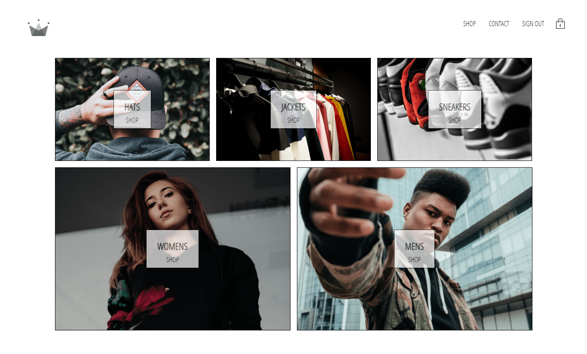
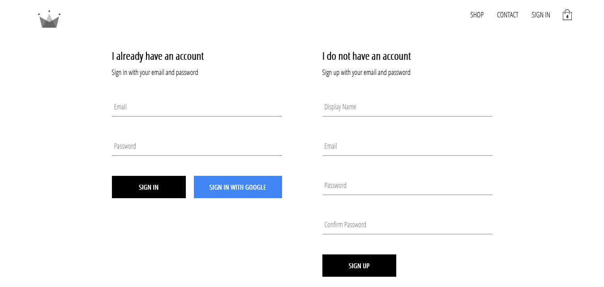
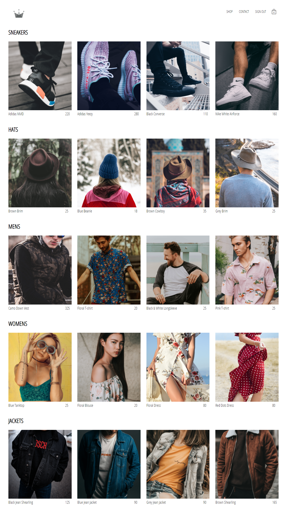
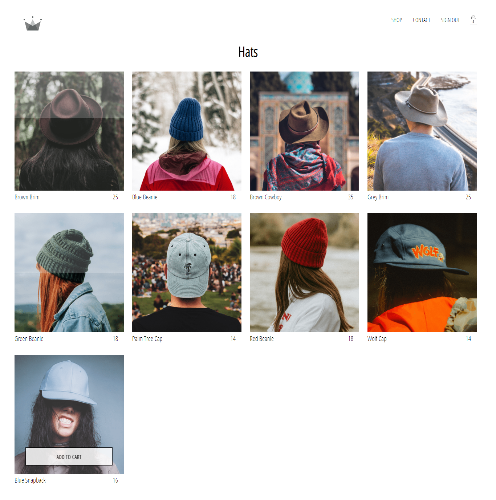
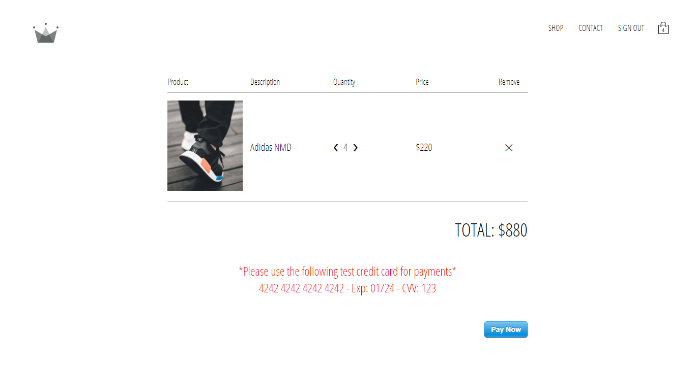
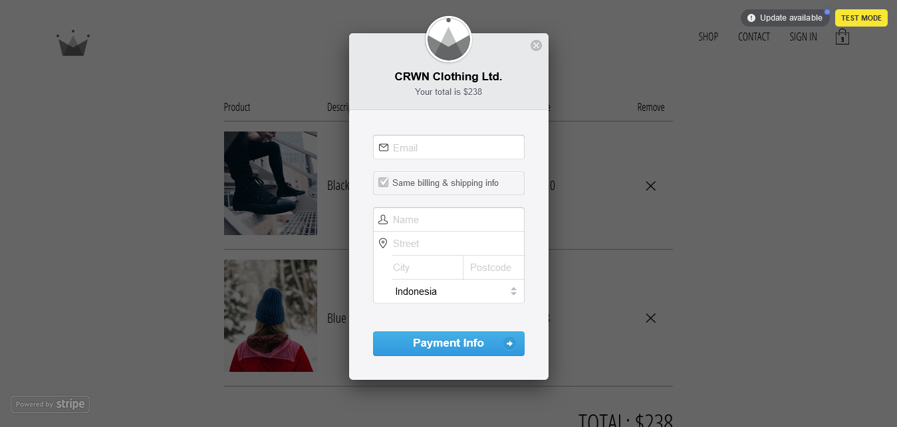

# crwn-clothing

Crwn Clothing is e-commerce web app, focusly only in clothing market. This project was built ReactJS and friends...

## Installation

Use the package manager [npm](https://www.npmjs.com/get-npm) to install all required dependecies.
```bash
npm install
```

## Usage

After install all dependecies, start developing by typing this:
```bash
npm run dev
```

If you ready for deployment, budling your entire project with:
```bash
npm build
```
this will create build folder for deployment itself.

## Screenshoots

<div align="center">
  Front page
  

  Signin & signup page
  

  Products
  
  

  Checkout
  

  Payment
  
</div>

## Related projects

You may also interest in my other projects too.

Blanja e-commerce web app (ReactJS).
- [`Blanja`](https://github.com/handa26/blanja-frontend)

Blanja e-commerce mobile app (React Native).
- [`Blanja`](https://github.com/handa26/blanja-native-app)

Blanja backend/RESTful API for Blanja projects.
- [`Blanja Backend`](https://github.com/handa26/products-api)